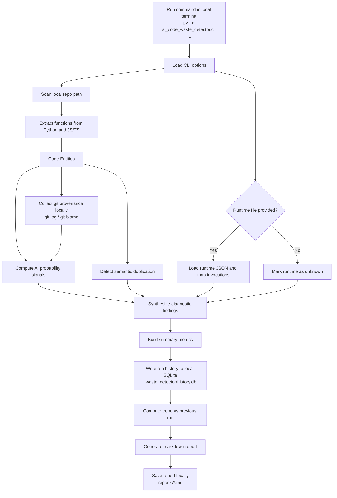

# AI Code Waste Detector

Read-only diagnostic tool for finding AI-generated code waste signals with evidence.

This MVP does **not** refactor, rewrite, or mutate source code. It only reports:

- probable AI-generated code (heuristic, confidence-based)
- git-backed provenance context (optional, enabled by default)
- high-confidence semantic duplication
- runtime-unused paths (when runtime evidence is provided)
- coarse annualized cost signal (optional)
- trend delta vs previous runs (SQLite history)

## Core behavior

- evidence before opinion
- probability, not certainty
- silence when confidence is low
- no auto-fix behavior

## Architecture Flow



## Quick start

1. Run analysis on a repo:

```powershell
py -m ai_code_waste_detector.cli --repo . --output reports/diagnostic.md
```

2. Include runtime evidence (optional):

```powershell
py -m ai_code_waste_detector.cli `
  --repo . `
  --runtime examples/runtime.example.json `
  --time-window-days 90 `
  --cost-per-invocation 0.0004 `
  --currency INR `
  --output reports/diagnostic.md
```

3. Tune thresholds (recommended for first real run):

```powershell
py -m ai_code_waste_detector.cli `
  --repo . `
  --ai-threshold 0.65 `
  --dup-threshold 0.90 `
  --min-dup-body-statements 3 `
  --min-dup-signature-chars 160 `
  --output reports/diagnostic.md
```

4. Disable git provenance if needed:

```powershell
py -m ai_code_waste_detector.cli --repo . --disable-git-provenance
```

5. Disable history storage if needed:

```powershell
py -m ai_code_waste_detector.cli --repo . --disable-history
```

6. Run tests:

```powershell
py -m unittest discover -s tests -v
```

7. JSON output for automation (default enabled):

```powershell
py -m ai_code_waste_detector.cli `
  --repo . `
  --output reports/diagnostic.md `
  --json-output reports/diagnostic.json
```

## Runtime evidence format

Supported JSON shapes:

1. Nested dictionary:

```json
{
  "functions": {
    "module.function_name": {
      "invocations": 1200,
      "last_invoked_at": "2026-02-14T11:00:00Z"
    }
  }
}
```

2. Flat dictionary:

```json
{
  "module.function_name": 1200
}
```

3. List of records:

```json
[
  {"name": "module.function_name", "invocations": 1200}
]
```

## Limitations

- parser targets: Python (`.py`) and script files (`.js`, `.jsx`, `.ts`, `.tsx`)
- AI provenance is heuristic, not authorship proof
- runtime mapping is best-effort by `qualified_name` then `function_name`
- test directories are excluded by default (use `--include-tests` to include them)
- script parsing is pattern-based (not a full JS/TS AST), so edge cases may be skipped
- git provenance depends on local git history availability and blame quality

## CI

- GitHub Actions workflow at `.github/workflows/diagnostic.yml`
- Runs tests + diagnostic scan on `push` and `pull_request` to `main`
- Uploads `reports/ci-diagnostic.md` and `reports/ci-diagnostic.json` as artifacts
